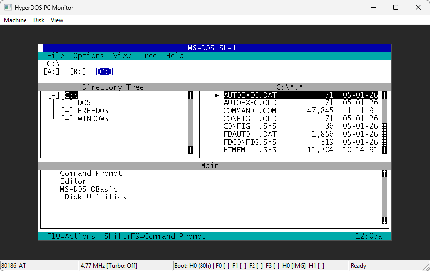
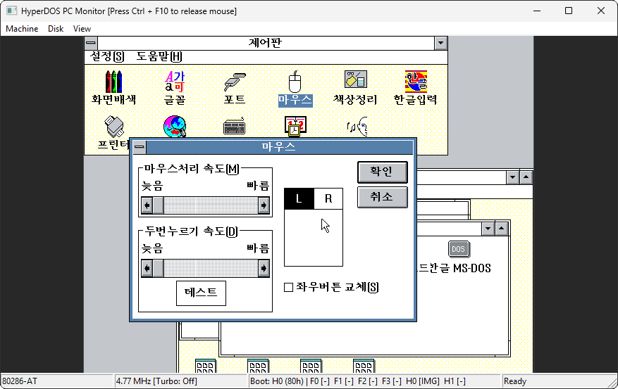
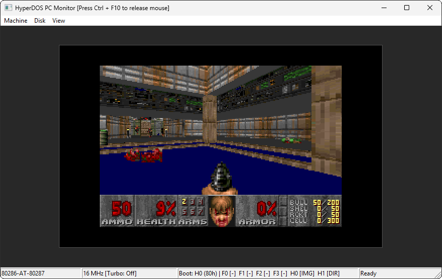

> [한국어](README_KR.md) | [English](README.md)
>
> I started this project to get hands-on experience with agentic coding.  
> For more context, see [this post](https://www.facebook.com/share/p/1itHsq4pjY/).

# HyperDOS

HyperDOS is a C11 IBM PC compatible emulator for running and studying DOS-era operating systems and software. It models the machine from the x86 processor, bus, chipset, BIOS, storage, keyboard, timer, and video layers instead of acting as a DOS API wrapper. The current practical target is real-mode DOS and Windows 3.0 compatibility, with the Win32 PC Monitor frontend providing an interactive way to boot disks, change machine settings, inspect state, and debug compatibility issues.

The project is still under active development. Correct hardware and BIOS behavior take priority over application-specific shortcuts, so compatibility is improved by extending the emulator model rather than adding one-off patches for a single program.

## Screenshots







## Emulated Machine

The emulator core is split from host-specific code. The portable core lives under `src/` and `include/hyperdos/`; the current interactive frontend lives under `platforms/win32/`.

Supported processor models:

- Intel 8086
- Intel 8088
- Intel 80186
- Intel 80188
- Intel 80286

The x86 core includes real-mode execution, 80186 instruction coverage, 80286 system instruction paths, descriptor tables, protected-mode exception delivery, and external bus-cycle accounting. The PC board currently provides 1 MiB of processor memory for the IBM PC compatible machine model.

Supported coprocessor choices:

- No coprocessor
- Intel 8087
- Intel 80287

Supported PC models:

- IBM PC XT style model, reported through the BIOS model identifier `0xFE`
- IBM PC AT style model, reported through the BIOS model identifier `0xFC`

The Win32 monitor defaults to an AT-style machine with an 80186 processor, no coprocessor, and the standard IBM PC 4.77 MHz processor clock unless changed from the menu or command line.

## Chipset And Board Devices

HyperDOS models the IBM PC compatible board as memory and input/output mappings on a shared bus. The chipset layer currently includes:

- Intel 8284 clock generator, using the 14.318181 MHz crystal and the standard 4.77 MHz default processor clock
- Intel 8288 bus controller, decoding processor status lines into memory, input/output, and interrupt acknowledge cycles
- Intel 8282 address latch for the multiplexed address bus
- Intel 8286 bus transceiver for data-bus direction and enable control

Board-level devices include:

- Programmable interrupt controller, with a second controller enabled for the AT model
- Direct memory access controller
- Programmable interval timer and PC speaker state reporting
- Programmable peripheral interface
- Intel 8042 keyboard controller with keyboard and auxiliary mouse paths
- CMOS real-time clock for the AT model
- First serial port UART register model
- Floppy controller
- Conventional RAM, BIOS ROM, CGA-compatible text memory, and VGA-style planar or chained graphics memory

## BIOS And Runtime Services

The BIOS layer installs the reset vector, BIOS data areas, interrupt vectors, equipment flags, disk state, video tables, and runtime interrupt handlers needed by DOS-era software.

Implemented service areas include:

- System BIOS services for boot setup, equipment reporting, conventional memory size, timer ticks, wait services, serial and printer interrupts, and AT pointing-device integration
- Keyboard BIOS services for scan-code processing, modifier state, standard and extended key reads, and the BIOS keyboard buffer
- Disk BIOS services for floppy and fixed-disk reads, writes, resets, geometry, status, and media-change behavior
- Video BIOS services for text cursor management, scrolling, teletype output, string output, pixel access, state save/restore, register access, and mode switching

## Video And Input

The video path covers classic text modes and common CGA, EGA, and VGA-compatible graphics modes used by DOS and Windows 3.0 era software:

- Text modes `00h`, `01h`, `02h`, and `03h`
- CGA graphics modes `04h`, `05h`, and `06h`
- Planar EGA/VGA modes `0Dh`, `0Eh`, `0Fh`, `10h`, `11h`, and `12h`
- VGA 256-color mode `13h`

The Win32 monitor can render text or graphics output, switch between code page 437 and Korean code page 949 text rendering, resize the display, capture the mouse, confine or hide the host cursor, and translate host keyboard and mouse input into PC keyboard controller events.

## Storage

HyperDOS uses raw disk image abstractions and also has Win32-backed file and directory disk providers. The monitor supports up to four floppy drives and two fixed-disk drives. Fixed disks can be addressed by zero-based fixed-disk index or by BIOS drive number starting at `80h`.

Common examples:

```bat
cmake-build-debug\hyperdos_win32_pc_monitor.exe --floppy-drive=0=images\dos.img
cmake-build-debug\hyperdos_win32_pc_monitor.exe --fixed-drive=0=images\harddisk.img
cmake-build-debug\hyperdos_win32_pc_monitor.exe --fixed-drive=80h=images\harddisk.img
```

Create a blank 32 MiB hard disk image on Windows:

```bat
fsutil file createnew images\harddisk.img 33554432
```

The created image is blank. Partition and format it inside DOS, for example with `FDISK`, reboot, then run `FORMAT C: /S`.

Disk images, operating systems, applications, and games are not included. Use only software and disk images that you are licensed to use.

## Win32 PC Monitor

The Win32 PC Monitor is the current interactive frontend. It provides:

- Machine menu for processor model, PC model, coprocessor model, processor clock, turbo mode, reset, and CPU tracing
- Disk menu for inserting or ejecting floppy images, mounting floppy directories, attaching or detaching fixed disks, mounting fixed-disk directories, and flushing disk images
- View menu for display scaling, text character set, mouse capture, cursor confinement, and cursor hiding
- Status bar showing machine, clock, boot drive, drive media, and runtime notifications
- Command-line tracing and dump options for CPU, disk, memory, guest memory, text screen, and video state investigation

Useful command-line options include:

```bat
--processor-model=8086
--processor-model=8088
--processor-model=80186
--processor-model=80188
--processor-model=80286
--processor-clock=12MHz
--8087
--80287
--no-coprocessor
--unthrottled-turbo
--disk-trace=logs\disk.txt
--cpu-trace=logs\cpu.txt
--memory-trace=logs\memory.txt
--guest-memory-dump=logs\memory.bin
--text-screen-dump=logs\screen.txt
--video-state-dump=logs\video.txt
--memory-watch=A0000+20000
```

## Building

Build with CMake on Windows using Visual Studio Build Tools and Ninja:

```bat
cmake -S . -B cmake-build-debug -G Ninja -DCMAKE_BUILD_TYPE=Debug
cmake --build cmake-build-debug
ctest --test-dir cmake-build-debug --output-on-failure
```

The Win32 monitor executable is produced at:

```text
cmake-build-debug\hyperdos_win32_pc_monitor.exe
```

Visual Studio users can open [hyperdos.vcxproj](hyperdos.vcxproj) in Visual Studio 2022 or later and build the `Debug|x64` configuration. That build produces:

```text
vs-build\x64\Debug\hyperdos.exe
```

## Repository Layout

```text
include/hyperdos/      Public headers for the portable emulator core
src/                   Processor, bus, chipset, BIOS, device, storage, and PC machine logic
platforms/win32/       Win32 PC Monitor frontend and host-backed disk providers
tests/                 Emulator regression tests
images/                Local disk-image workspace, not required for the core library
.resources/            README screenshots and project media
CMakeLists.txt         Main CMake build
hyperdos.vcxproj       Visual Studio project for the Win32 monitor
```
