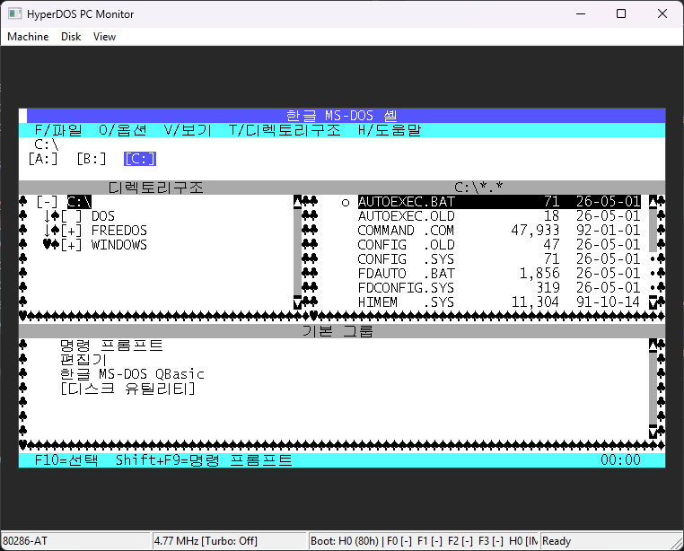

> [한국어](README_KR.md) | [English](README.md)
>
> 이 프로젝트는 제가 에이전틱 코딩을 직접 경험해보기 위해 진행한 프로젝트입니다.  
> 자세한 내용은 [이 글](https://www.facebook.com/share/p/1itHsq4pjY/)을 참고해주세요.

# HyperDOS

HyperDOS는 DOS 시대의 운영체제와 소프트웨어를 실행하고 분석하기 위한 C11 기반 IBM PC 호환 에뮬레이터입니다. 단순히 DOS API를 흉내 내는 방식이 아니라, x86 프로세서, 버스, 칩셋, BIOS, 저장장치, 키보드, 타이머, 비디오 계층을 PC 하드웨어 모델로 구성합니다. 현재 실용적인 목표는 리얼 모드 DOS와 Windows 3.0 호환성이고, Win32 PC Monitor 프론트엔드는 디스크 부팅, 머신 설정 변경, 상태 확인, 호환성 디버깅을 위한 인터랙티브 환경을 제공합니다.

이 프로젝트는 아직 개발 중입니다. 특정 프로그램만 통과시키는 단발성 패치보다 올바른 하드웨어와 BIOS 동작을 우선하며, 호환성은 에뮬레이터 모델을 확장하는 방식으로 개선합니다.

## 스크린샷




## 에뮬레이션 머신

에뮬레이터 코어는 호스트 플랫폼 코드와 분리되어 있습니다. 이식 가능한 코어는 `src/`와 `include/hyperdos/`에 있고, 현재 인터랙티브 프론트엔드는 `platforms/win32/`에 있습니다.

지원 프로세서 모델:

- Intel 8086
- Intel 8088
- Intel 80186
- Intel 80188
- Intel 80286

x86 코어는 리얼 모드 실행, 80186 명령어, 80286 시스템 명령 경로, 디스크립터 테이블, 보호 모드 예외 전달, 외부 버스 사이클 카운팅을 포함합니다. 현재 PC 보드는 IBM PC 호환 머신 모델에 대해 1 MiB 프로세서 메모리를 제공합니다.

지원 코프로세서 선택지:

- 코프로세서 없음
- Intel 8087
- Intel 80287

지원 PC 모델:

- IBM PC XT 계열 모델, BIOS 모델 식별자 `0xFE`로 보고
- IBM PC AT 계열 모델, BIOS 모델 식별자 `0xFC`로 보고

Win32 모니터의 기본값은 AT 계열 머신, 80186 프로세서, 코프로세서 없음, 표준 IBM PC 4.77 MHz 프로세서 클록입니다. 메뉴나 명령행에서 변경할 수 있습니다.

## 칩셋과 보드 장치

HyperDOS는 IBM PC 호환 보드를 하나의 공유 버스 위에 배치된 메모리 및 입출력 매핑으로 모델링합니다. 현재 칩셋 계층에는 다음 요소가 있습니다.

- Intel 8284 클록 생성기, 14.318181 MHz 크리스털과 표준 4.77 MHz 기본 프로세서 클록 사용
- Intel 8288 버스 컨트롤러, 프로세서 상태 라인을 메모리, 입출력, 인터럽트 승인 사이클로 디코딩
- Intel 8282 주소 래치, 멀티플렉스 주소 버스 캡처
- Intel 8286 버스 트랜시버, 데이터 버스 방향과 활성 상태 제어

보드 수준 장치:

- 프로그래머블 인터럽트 컨트롤러, AT 모델에서는 두 번째 컨트롤러 활성화
- 직접 메모리 접근 컨트롤러
- 프로그래머블 인터벌 타이머와 PC 스피커 상태 보고
- 프로그래머블 주변장치 인터페이스
- Intel 8042 키보드 컨트롤러, 키보드 및 보조 마우스 경로 포함
- AT 모델용 CMOS 실시간 시계
- 첫 번째 직렬 포트 UART 레지스터 모델
- 플로피 컨트롤러
- 컨벤셔널 RAM, BIOS ROM, CGA 호환 텍스트 메모리, VGA 스타일 플래너 및 체인드 그래픽 메모리

## BIOS와 런타임 서비스

BIOS 계층은 DOS 시대 소프트웨어에 필요한 리셋 벡터, BIOS 데이터 영역, 인터럽트 벡터, 장비 플래그, 디스크 상태, 비디오 테이블, 런타임 인터럽트 핸들러를 설치합니다.

구현된 서비스 영역:

- 부팅 설정, 장비 정보, 컨벤셔널 메모리 크기, 타이머 틱, 대기 서비스, 직렬 및 프린터 인터럽트, AT 포인팅 장치 통합을 위한 시스템 BIOS 서비스
- 스캔 코드 처리, 수정 키 상태, 표준 및 확장 키 읽기, BIOS 키보드 버퍼를 위한 키보드 BIOS 서비스
- 플로피와 고정 디스크 읽기, 쓰기, 리셋, 지오메트리, 상태, 미디어 변경 동작을 위한 디스크 BIOS 서비스
- 텍스트 커서 관리, 스크롤, 텔레타이프 출력, 문자열 출력, 픽셀 접근, 상태 저장과 복원, 레지스터 접근, 모드 전환을 위한 비디오 BIOS 서비스

## 비디오와 입력

비디오 경로는 DOS와 Windows 3.0 시대 소프트웨어가 사용하는 고전적인 텍스트 모드와 주요 CGA, EGA, VGA 호환 그래픽 모드를 다룹니다.

- 텍스트 모드 `00h`, `01h`, `02h`, `03h`
- CGA 그래픽 모드 `04h`, `05h`, `06h`
- 플래너 EGA/VGA 모드 `0Dh`, `0Eh`, `0Fh`, `10h`, `11h`, `12h`
- VGA 256색 모드 `13h`

Win32 모니터는 텍스트 및 그래픽 출력 렌더링, 코드 페이지 437과 한국어 코드 페이지 949 텍스트 렌더링 전환, 화면 크기 조정, 마우스 캡처, 호스트 커서 제한 또는 숨김, 호스트 키보드와 마우스 입력을 PC 키보드 컨트롤러 이벤트로 변환하는 기능을 제공합니다.

## 저장장치

HyperDOS는 raw 디스크 이미지 추상화를 사용하며, Win32 기반 파일 및 디렉터리 디스크 제공자도 포함합니다. 모니터는 최대 네 개의 플로피 드라이브와 두 개의 고정 디스크 드라이브를 지원합니다. 고정 디스크는 0부터 시작하는 고정 디스크 인덱스나 `80h`부터 시작하는 BIOS 드라이브 번호로 지정할 수 있습니다.

일반적인 예:

```bat
cmake-build-debug\hyperdos_win32_pc_monitor.exe --floppy-drive=0=images\dos.img
cmake-build-debug\hyperdos_win32_pc_monitor.exe --fixed-drive=0=images\harddisk.img
cmake-build-debug\hyperdos_win32_pc_monitor.exe --fixed-drive=80h=images\harddisk.img
```

Windows에서 32 MiB 빈 하드 디스크 이미지를 만드는 예:

```bat
fsutil file createnew images\harddisk.img 33554432
```

생성된 이미지는 빈 디스크입니다. DOS 안에서 `FDISK`로 파티션을 만들고 재부팅한 뒤 `FORMAT C: /S` 같은 명령으로 포맷해야 부팅 가능한 디스크가 됩니다.

디스크 이미지, 운영체제, 응용 프로그램, 게임은 포함되어 있지 않습니다. 사용 권한이 있는 소프트웨어와 디스크 이미지만 사용해야 합니다.

## Win32 PC Monitor

Win32 PC Monitor는 현재 인터랙티브 프론트엔드입니다. 다음 기능을 제공합니다.

- 프로세서 모델, PC 모델, 코프로세서 모델, 프로세서 클록, 터보 모드, 리셋, CPU 트레이스를 위한 Machine 메뉴
- 플로피 이미지 삽입과 배출, 플로피 디렉터리 마운트, 고정 디스크 연결과 분리, 고정 디스크 디렉터리 마운트, 디스크 이미지 flush를 위한 Disk 메뉴
- 화면 스케일링, 텍스트 문자 집합, 마우스 캡처, 커서 제한, 커서 숨김을 위한 View 메뉴
- 머신, 클록, 부팅 드라이브, 드라이브 미디어, 런타임 알림을 보여주는 상태 표시줄
- CPU, 디스크, 메모리, 게스트 메모리, 텍스트 화면, 비디오 상태 분석을 위한 명령행 트레이스와 덤프 옵션

유용한 명령행 옵션:

```bat
--processor-model=8086
--processor-model=8088
--processor-model=80186
--processor-model=80188
--processor-model=80286
--processor-clock=12MHz
--8087
--80287
--no-coprocessor
--unthrottled-turbo
--disk-trace=logs\disk.txt
--cpu-trace=logs\cpu.txt
--memory-trace=logs\memory.txt
--guest-memory-dump=logs\memory.bin
--text-screen-dump=logs\screen.txt
--video-state-dump=logs\video.txt
--memory-watch=A0000+20000
```

## 빌드

Windows에서 Visual Studio Build Tools와 Ninja를 사용해 CMake로 빌드:

```bat
cmake -S . -B cmake-build-debug -G Ninja -DCMAKE_BUILD_TYPE=Debug
cmake --build cmake-build-debug
ctest --test-dir cmake-build-debug --output-on-failure
```

Win32 모니터 실행 파일 위치:

```text
cmake-build-debug\hyperdos_win32_pc_monitor.exe
```

Visual Studio 사용자는 Visual Studio 2022 이상에서 [hyperdos.vcxproj](hyperdos.vcxproj)를 열고 `Debug|x64` 구성으로 빌드할 수 있습니다. 해당 빌드 결과물은 다음 위치에 생성됩니다.

```text
vs-build\x64\Debug\hyperdos.exe
```

## 저장소 구조

```text
include/hyperdos/      이식 가능한 에뮬레이터 코어의 공개 헤더
src/                   프로세서, 버스, 칩셋, BIOS, 장치, 저장장치, PC 머신 로직
platforms/win32/       Win32 PC Monitor 프론트엔드와 호스트 기반 디스크 제공자
tests/                 에뮬레이터 회귀 테스트
images/                로컬 디스크 이미지 작업 공간, 코어 라이브러리에는 필요하지 않음
.resources/            README 스크린샷과 프로젝트 미디어
CMakeLists.txt         메인 CMake 빌드
hyperdos.vcxproj       Win32 모니터용 Visual Studio 프로젝트
```
